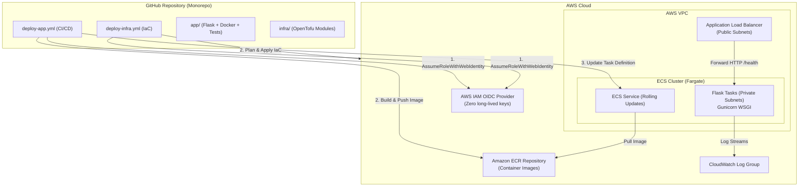

# ECS Fargate CI/CD with Python Flask, OpenTofu & GitHub Actions

A production-grade **Monorepo** template for deploying a containerized Python Flask application to **AWS ECS Fargate** using **OpenTofu** for Infrastructure as Code (IaC) and **GitHub Actions** with **OpenID Connect (OIDC)** authentication for zero-secret CI/CD.

---

## Architecture Overview



---

## Directory Structure

```text
.
├── .github/
│   └── workflows/
│       ├── ci.yml                 # PR & Branch checks (pytest, ruff, docker, tofu validate)
│       ├── deploy-app.yml         # Builds & deploys container to ECS Fargate via OIDC
│       └── deploy-infra.yml       # OpenTofu plan/apply workflow via OIDC
├── app/
│   ├── src/
│   │   ├── __init__.py
│   │   └── app.py                 # Flask app with /health and /api/v1/info endpoints
│   ├── tests/
│   │   ├── __init__.py
│   │   └── test_app.py            # Pytest test suite
│   ├── .dockerignore
│   ├── Dockerfile                 # Multi-stage build with non-root appuser & Gunicorn
│   ├── pyproject.toml             # Python configuration & test settings
│   └── requirements.txt           # Application dependencies
├── infra/
│   ├── modules/
│   │   ├── alb/                   # Application Load Balancer & Target Group
│   │   ├── ecr/                   # Elastic Container Registry + Lifecycle Policy
│   │   ├── ecs/                   # ECS Cluster, Task Definition, Service, IAM Roles
│   │   ├── oidc/                  # GitHub Actions OIDC Provider & IAM Deploy Role
│   │   └── vpc/                   # Multi-AZ VPC, Subnets, IGW, NAT Gateway
│   ├── main.tf                    # Root OpenTofu orchestration
│   ├── variables.tf               # Input variables
│   ├── outputs.tf                 # Exported outputs (ALB DNS, ECR URL, Role ARN)
│   ├── versions.tf                # OpenTofu and AWS provider constraints
│   └── terraform.tfvars.example   # Example variable overrides
├── Makefile                       # Developer shortcuts
└── README.md
```

---

## Getting Started

### 1. Local Development & Testing

```bash
# Create and activate Python virtualenv
python3 -m venv .venv
source .venv/bin/activate

# Install dependencies
pip install -r app/requirements.txt

# Run linter & test suite
ruff check app/
pytest app/tests/ -v

# Run Flask locally
python app/src/app.py
# Verify: curl http://localhost:5000/health
```

### 2. Local Container Build

```bash
# Build the Docker image
docker build -t ecs-flask-app:latest ./app

# Run container locally
docker run -p 5000:5000 --rm ecs-flask-app:latest

# Test endpoint
curl http://localhost:5000/health
```

---

## Deploying Infrastructure with OpenTofu

### Step 1: Configure OpenTofu Variables
Copy `infra/terraform.tfvars.example` to `infra/terraform.tfvars` and set your GitHub repository info:

```hcl
aws_region    = "us-east-1"
project_name  = "ecs-flask"
environment   = "dev"
github_repo   = "YOUR_GITHUB_USER_OR_ORG/ecs-with-cicd"
github_branch = "main"
```

### Step 2: Initialize and Apply
```bash
cd infra

# Initialize OpenTofu
tofu init

# Check the plan
tofu plan

# Provision AWS resources
tofu apply
```

Outputs will display:
* `alb_endpoint`: URL of the load balancer (e.g., `http://ecs-flask-dev-alb-xxx.us-east-1.elb.amazonaws.com`)
* `ecr_repository_url`: ECR image repository URI
* `github_actions_role_arn`: ARN of the IAM role to use in GitHub Secrets

---

## Configuring GitHub Actions CI/CD

In your GitHub repository settings (**Settings > Secrets and variables > Actions**):

### 1. Repository Secrets
| Name | Description | Example |
| :--- | :--- | :--- |
| `AWS_ROLE_TO_ASSUME` | ARN of the IAM Role created by the OIDC module | `arn:aws:iam::123456789012:role/ecs-flask-dev-github-actions-role` |

### 2. Repository Variables (Optional overrides)
| Name | Description | Default |
| :--- | :--- | :--- |
| `AWS_REGION` | AWS Region | `us-east-1` |
| `ECR_REPOSITORY` | Name of the ECR repository | `ecs-flask-dev` |
| `ECS_CLUSTER` | Name of the ECS cluster | `ecs-flask-dev-cluster` |
| `ECS_SERVICE` | Name of the ECS service | `ecs-flask-dev-service` |

---

## CI/CD Pipeline Flow

1. **Pull Requests / Branches**:
   * Runs `.github/workflows/ci.yml`.
   * Executes Pytest suite with code coverage.
   * Lints code using Ruff.
   * Validates Docker image build.
   * Runs `tofu fmt -check` and `tofu validate`.

2. **Deploy Application (`main` branch push to `app/**`)**:
   * Runs `.github/workflows/deploy-app.yml`.
   * Exchanges GitHub JWT for temporary AWS STS credentials via OIDC.
   * Builds and tags Docker container with Git Commit SHA.
   * Pushes image to Amazon ECR.
   * Deploys new Task Definition to ECS Fargate with zero-downtime rolling update.

3. **Deploy Infrastructure (`main` branch push to `infra/**`)**:
   * Runs `.github/workflows/deploy-infra.yml`.
   * Authenticates via OIDC.
   * Runs `tofu plan` and `tofu apply -auto-approve`.

---

## Security Features

* **No Long-Lived AWS Keys**: Uses AWS IAM OpenID Connect (OIDC) identity federation with scoped trust policies.
* **Least Privilege**: Deployment IAM role is restricted only to the designated ECR repo, ECS service, and pass-role to ECS task roles.
* **Non-Root Container**: Container runs under a non-privileged `appuser` (UID 10001).
* **Private Network Isolation**: Fargate tasks run in VPC subnets with network security groups that only accept traffic from the ALB.
* **Zero-Downtime Deployments**: ECS Service configured with `minimum_healthy_percent = 100` and `maximum_percent = 200`.
